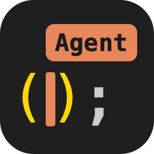
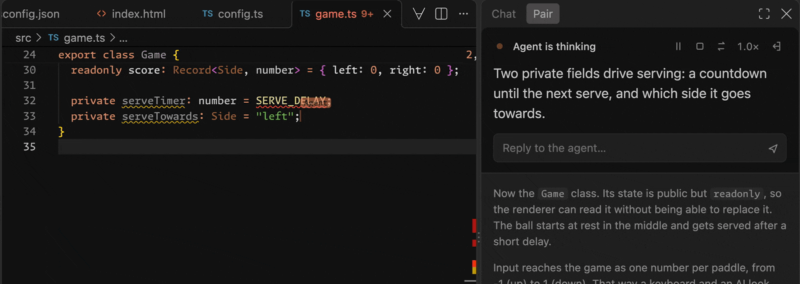
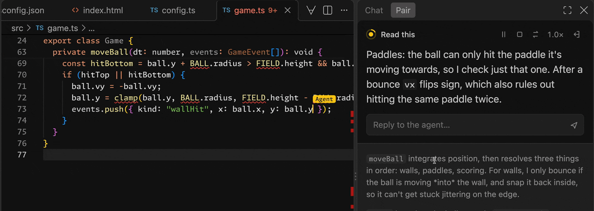
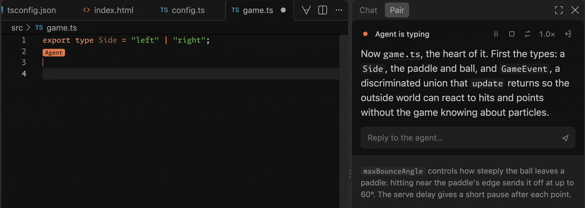
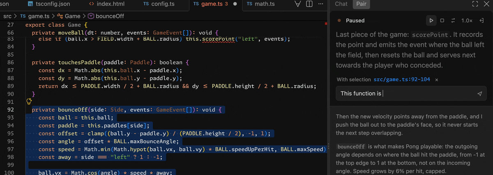

#  AI Pair Programmer

**[Install it from the VS Code Marketplace](https://marketplace.visualstudio.com/items?itemName=michalstrba.ai-pair)**

## For those of us who want, need, or love to stay close to the code

> A **mirror neuron** is a neuron that fires both when an animal acts and when
> the animal observes the same action performed by another.
>
> — [Wikipedia](https://en.wikipedia.org/wiki/Mirror_neuron)

**Be there for every keystroke**



Some of us, at least some of the time, want to understand our code at a deep
level. For that, handing a task to an agent and reviewing the diff that comes
back can be exhausting. With *AI Pair Programmer*, you're there for every
keystroke instead, and you end up knowing the code almost as if you'd typed it
yourself.

It's pair programming where your coding agent has the keyboard. It types in
your editor slowly enough to follow and explains what it's doing. Interrupt it
whenever you like, or take over and let it watch you for a change.

**Interrupt and steer**



**Watch it change its mind in real time**



It's also a good way to learn a new technology, or to have the agent walk you
through code you don't know yet.

**Ask it to explain code line by line**



It works in VS Code, with the coding agent you already use. Setup is built in
for Claude Code, Codex, OpenCode, Gemini CLI, Cursor and GitHub Copilot, and
any agent that supports MCP can be connected by hand.

**Note:** It works best with strong models; weaker ones tend to struggle with
this way of working.

## How to use it

Once the extension is [installed](#install) and
[connected to your agent](#connect-your-agent), keep using your agent as usual.
When you want to pair:

1. Open the project in VS Code, and start your agent **in the same folder** (or
   a subfolder of it).
2. Ask it to pair: *"Let's pair on adding a settings page."* In Claude Code,
   you can also run `/mcp__pair__start`. If you want to learn the technology
   too, say so: *"…I'm new to Svelte, explain as you go."*
3. The **Pair** panel opens in the secondary side bar, and the agent's cursor
   appears in your editor.

Anything you say or edit interrupts the agent, so its next move takes it into
account. While you pair:

| To… | Do this |
|---|---|
| say something to the agent | type in the reply box, press Enter. Typing pauses playback. |
| ask about some code | select it in the editor, then reply: the selection goes along (× leaves it out) |
| let it run a command | the agent's tests and builds play in an *AI Pair* terminal; **Run**, **Allow for session**, or **Skip** in the panel |
| stop it right now | **Interrupt**, or just edit the code: any edit interrupts |
| look around | scroll or switch files. Playback pauses until you **Resume**, which brings you back to the agent's cursor |
| write a part yourself | **My turn**. The agent becomes the navigator and comments as you type. **Hand back** returns the turn, with your reply if you typed one |
| change the pace | the speed menu (**1.0×**), from 0.4× to 3.0× |
| finish | **End**, or tell the agent you're done. You can pair again anytime |

The cursor's color tells you what the agent is doing. It's yellow and pulsing
when it's just said something and is waiting for you to read it.

**Try it without an agent:** *AI Pair: Play Demo Session* plays a scripted
session that adds a small API to an Express app, which it creates in
`ai-pair-demo/`.

## How it works under the hood

```
agent (Claude Code, …) ── stdio MCP ──▶ pair-mcp ── local WebSocket ──▶ VS Code extension
```

The agent submits small batches of actions: say, move, select, type, delete,
point, run. The extension plays them at a human pace and reports back exactly
what happened, including everything you did in the meantime. The agent plans
its next batch while you watch the current one, which hides most of its
thinking time. And it's never more than one batch ahead, so your interruptions
land immediately.

The design is written up in:

- [PROTOCOL.md](PROTOCOL.md): the tools and their exact semantics, as the agent sees them.
- [AGENT_GUIDE.md](AGENT_GUIDE.md): how the agent should pair, returned to it when a session starts.
- [DESIGN.md](DESIGN.md): what you see: the cursor, the panel, the timing.
- [ARCHITECTURE.md](ARCHITECTURE.md): the components and how they connect.

## Install

You need **VS Code 1.105 or newer**. Install **AI Pair** from the
[VS Code Marketplace](https://marketplace.visualstudio.com/items?itemName=michalstrba.ai-pair): in the
Extensions view, search for `@id:michalstrba.ai-pair`, or run:

```sh
code --install-extension michalstrba.ai-pair
```

To build it from source instead, you also need **Node.js 20 or newer**:

```sh
git clone https://github.com/faiface/ai-pair.git
cd ai-pair
npm install
npm run package
code --install-extension ai-pair-*.vsix
```

### JetBrains IDEs

The plugin works in any JetBrains IDE **2026.1 or newer**: IntelliJ IDEA,
GoLand, WebStorm, PyCharm, Rider, and the rest. To run it, you need:

- **Node.js 20 or newer** on your `PATH`. The plugin runs its sidecar and the
  agent's MCP server with it; unlike VS Code, the IDE has no runtime of its
  own to lend them.
- The IDE's bundled **Terminal** plugin, enabled (it is by default), and its
  default runtime, which has the JCEF browser the narration panel needs.

To build it, you also need:

- **npm** (or Bun), for the TypeScript parts.
- **JDK 21 or newer**, which Gradle runs on: `java` on your `PATH`, or
  `JAVA_HOME`.
- An internet connection: on the first build, Gradle downloads its
  dependencies and, unless you point it at an IDE you have (below), GoLand
  2026.1.3 to compile against, a large download.

Build the plugin from source:

```sh
git clone https://github.com/faiface/ai-pair.git
cd ai-pair
npm install
cd packages/intellij
./gradlew buildPlugin       # on Windows: .\gradlew.bat buildPlugin
```

To compile against a JetBrains IDE you already have, instead of downloading
GoLand, add its install folder (2026.1 or newer), e.g.
`-PplatformPath="C:/Program Files/JetBrains/GoLand 2026.1"`, or
`-PplatformPath=/Applications/GoLand.app/Contents` on macOS.

Then install it: in the IDE, **Settings → Plugins → ⚙ → Install Plugin from
Disk…**, choose `packages/intellij/build/distributions/ai-pair-intellij-0.1.0.zip`,
and restart the IDE.

## Connect your agent

### VS Code

1. **Open a project folder in VS Code.** The extension installs the MCP server
   your agent runs, at `~/.ai-pair/bin/pair-mcp`
   (`%USERPROFILE%\.ai-pair\bin\pair-mcp.cmd` on Windows). It runs on
   VS Code's own runtime, so it doesn't need Node.js.
2. **Run *AI Pair: Set Up Agent*** from the command palette (VS Code also
   offers this the first time the extension starts). Pick your agents; the
   ones it finds installed are already checked. For each one, it adds a
   server named `pair` to that agent's user-wide MCP configuration, leaving
   everything else in the file as it was:

   | Agent | Where |
   |---|---|
   | **Claude Code** (the CLI, the IDE extensions, the Claude desktop app's Code tab) | `claude mcp add --scope user`, or `~/.claude.json` without the `claude` command |
   | **Codex** (the CLI, the IDE extension, the app) | `~/.codex/config.toml` (or in `$CODEX_HOME`) |
   | **OpenCode** | `~/.config/opencode/opencode.json` (`.jsonc` if you have one), on Windows too |
   | **Gemini CLI** | `~/.gemini/settings.json` |
   | **Cursor** | `~/.cursor/mcp.json` |
   | **Another agent** | copies an MCP server configuration to the clipboard: a stdio server named `pair` running the launcher |

   **GitHub Copilot** in VS Code needs none of this: the extension gives it
   the `pair` server itself.
3. **Restart your agent** so it picks up the new server.

### JetBrains IDEs

1. **Open a project in the IDE.** The plugin starts its sidecar for the
   project and registers the window, so the server can find it. The first
   time, it offers to set up your agent.
2. **Run Tools → AI Pair → Set Up Agent.** It installs the launcher at
   `~/.ai-pair/bin/pair-mcp` (`%USERPROFILE%\.ai-pair\bin\pair-mcp.cmd` on
   Windows), which runs the plugin's MCP server with Node, then asks which
   agent you pair with:

   | Choice | What it does |
      |---|---|
   | **Claude Code (CLI)** | runs `claude mcp add --scope user pair -- <launcher>` in a terminal tab, for all your projects |
   | **Claude Code (this project)** | adds the `pair` server to `.mcp.json` in the project folder; also works in the Claude desktop app |
   | **Another agent** | copies an MCP server configuration to the clipboard: a stdio server named `pair` running the launcher. Add it where your agent keeps its MCP servers, e.g. the files in the VS Code table above |

3. **Restart your agent** so it picks up the new server.

VS Code's extension and the plugin install the same launcher, which runs
whichever installed it last. If you use both, build both from the same
checkout.

## Settings

| Setting | |
|---|---|
| `aiPair.speed` | Overall playback speed (the panel's speed menu offers 0.4× to 3.0×). |
| `aiPair.agentName` | The name on the agent's cursor. |
| `aiPair.timing` | Fine-tune any typing or pause duration, e.g. `{ "afterSelectMs": 900, "type": { "wordStartMs": 140 } }`. Every key is in [`timing.ts`](packages/core/src/timing.ts). |
| `aiPair.confirmCommands` | Ask before each command the agent runs in the terminal (default on). Turned off, the agent's commands run without any prompt, not even its own. |

In a JetBrains IDE, the same settings are in **Settings → Tools → AI Pair**,
with the timing as JSON. *All Projects* has all four. *This Project* can
override the speed, the agent name and the timing for one project, kept in
its `.idea/aiPair.xml`.

## Troubleshooting

- **The agent says `no_editor`.** Its working directory isn't inside a folder
  that's open in VS Code. Open that folder in VS Code, or start the agent in
  it.
- **The agent doesn't have the pair tools.** Restart the agent after setting
  it up. *AI Pair: Set Up Agent* marks the agents that are set up. With
  Claude Code, `claude mcp list` should show `pair`. With Copilot, `pair`
  should be in *MCP: List Servers*; start it there if it isn't running.
- **After updating the extension,** reload the VS Code window and restart the
  agent.

In a JetBrains IDE:

- **Nothing happens, or the agent says `no_editor`.** The plugin needs `node`
  on the `PATH` the IDE sees; restart the IDE after installing Node. The
  IDE's log (Help → Show Log in Explorer/Finder, `idea.log`) has the
  sidecar's messages, starting with `host:`.
- **The agent says `no_editor` though the project is open.** Only the
  project's base folder counts for now, not its other content roots. Start
  the agent in the base folder or below it.
- **Don't open the same folder in VS Code and a JetBrains IDE at once.** The
  IDE doesn't report window focus yet, so the agent may pair in VS Code
  instead.
- **After updating the plugin,** restart the IDE and the agent.

## Development

```
packages/
  protocol/       types shared by everything
  core/           editor-agnostic sessions, playback, and the local WebSocket server
  relay/          pair-mcp, the MCP server the agent runs
  vscode/         the extension, which ships the relay
  intellij-host/  the JetBrains plugin's Node sidecar: core, talking to the plugin over stdio
  intellij/       the JetBrains plugin (Kotlin, Gradle), which ships the sidecar and the relay
```

```sh
npm install
npm test                  # unit and end-to-end tests
npm run typecheck
npm run build             # development build of the extension
npm run test:integration  # plays a session inside a real, isolated VS Code (macOS)
npm run package           # production build → ai-pair-<version>.vsix
```

To run your working copy, open the repository in VS Code and press F5, or:

```sh
code --extensionDevelopmentPath="$PWD/packages/vscode" <a project folder>
```

The JetBrains plugin, from `packages/intellij` (`.\gradlew.bat` on Windows; add
`-PplatformPath=…` to use an IDE you have):

```sh
./gradlew buildPlugin                              # → build/distributions/ai-pair-intellij-<version>.zip
./gradlew runIde -PopenProject=<a project folder>  # a sandbox IDE with your working copy
./gradlew integrationTest                          # plays a session inside a real, isolated IDE
```

`runIde` also takes `-PaiPairHome=<a folder>`, to keep the sandbox's launcher
and window registrations out of your real `~/.ai-pair`.

### Releasing

Add a section for the new version to
[`packages/vscode/CHANGELOG.md`](packages/vscode/CHANGELOG.md), then, on an
up-to-date `main`:

```sh
npm run release -- patch   # or minor, major, or an exact version
```

It runs every test, bumps the version, builds the `.vsix` once and publishes
that file to the Marketplace, then commits, tags and pushes the release and
makes a GitHub release with the `.vsix` attached. It asks before publishing,
since a version can't be published twice. It needs `vsce login michalstrba` and
`gh auth login` done once.

## License

[MIT](LICENSE)
